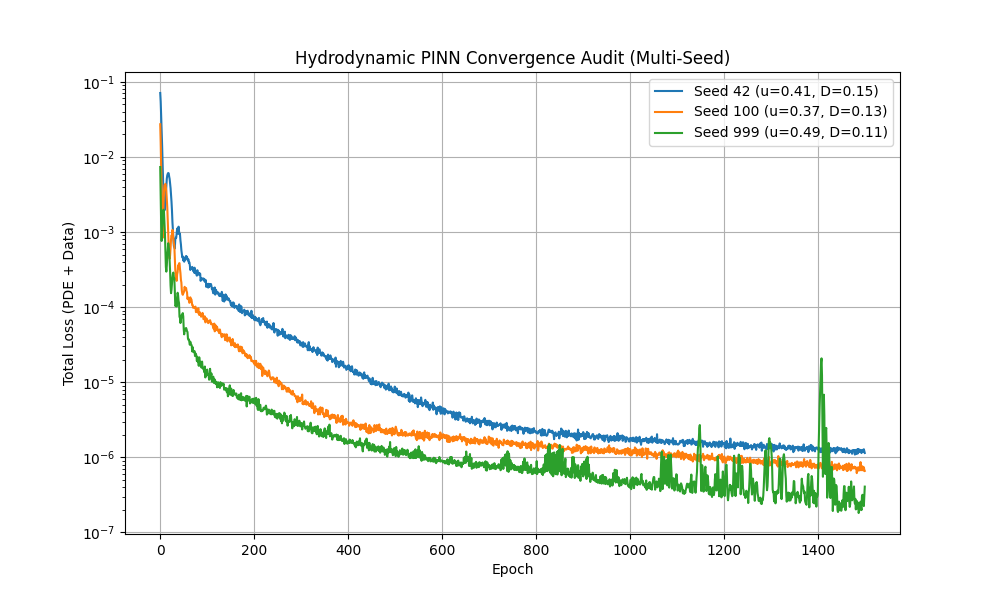
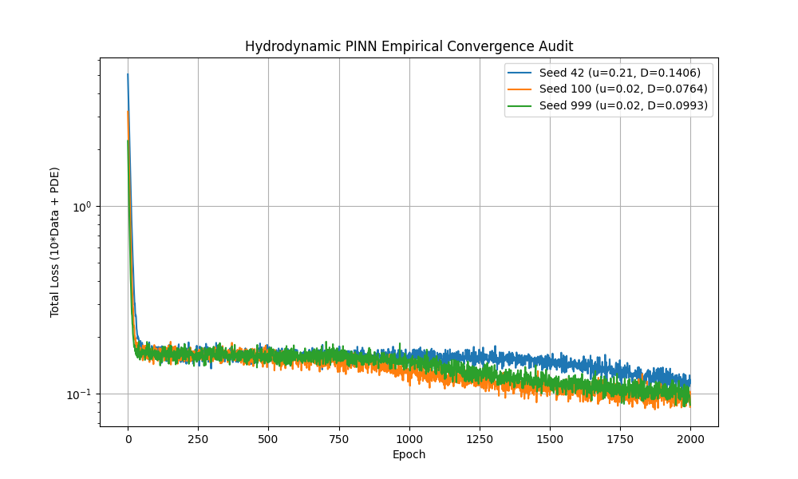

# Flow order

This repository contains the architecture implementation for "Order Flow", an advanced quantitative finance framework modeling liquidity depth as a continuous fluid density field governed by an Advection-Diffusion partial differential equation (PDE).

## Architecture Overview

```text
[ Live Network Socket (UDP) ] OR [ Binary L3 Replay Feed ]
                   │
                   ▼
┌────────────────────────────────────────────────────────┐
│ PHASE 1: Low-Latency Ingestion Engine (C++)            │
│ ── Live Zero-Copy Sockets / Mmap Replay Options        │
│ ── AVX2 SIMD Level-2 Book State Reconstruction         │
└──────────────────┬─────────────────────────────────────┘
                   │
                   ▼ (Streaming Feature Tensors)
┌────────────────────────────────────────────────────────┐
│ PHASE 2: Hydrodynamic Physics Engine                   │
│ ── Order Book modeled as Fluid Density Field ρ(x,t)    │
│ ── Advection-Diffusion Boundary Tracking               │
└──────────────────┬─────────────────────────────────────┘
                   │
                   ▼ (SRAM Pre-Cached Spatial Tensors)
┌────────────────────────────────────────────────────────┐
│ PHASE 3: Fused Triton / Intel XPU Inference Kernel      │
│ ── SRAM-Tiled Matrix Multiplication                    │
│ ── Fused Softplus Physics-Anchor Alpha Prediction      │
└────────────────────────────────────────────────────────┘
```

## System Implementation

### 1. The Core Pipeline: C++ Low-Latency Engine
Located in `src/ingestion_engine.cpp`, this C++ component is designed for ultra-fast L2 order book updates leveraging AVX2 `__m256i` registers to avoid cache line bouncing and eliminate memory allocations during hot-path execution. 

**Ingestion Mechanisms:**
- **Replay Mode (Default):** Memory-maps a file directly into the virtual address space using `MapViewOfFile`. Ideal for high-speed historical backtesting.
- **Live Mode (`--live`):** Initializes a live UDP multicast Winsock listener to process inbound L3 exchange binaries on-the-fly, bridging the engine from backtesting directly to real-time.

**To compile (Using MSVC Developer Command Prompt on Windows):**
```bash
cl.exe /O2 /arch:AVX2 /LD src/ingestion_engine.cpp /Fe:src/ingestion_engine.dll
```

**Latency Benchmarks (10,000,000 Messages):**
- **Python Baseline:** `scripts/benchmark_python.py` measures **~637.8 nanoseconds** per message (6.37 seconds total).
- **C++ SIMD AVX2 Engine (Windows DLL via ctypes):** `src/python_bridge.py` measures **~14.86 nanoseconds** per message (0.148 seconds total).
- **Speedup:** **43x faster** execution, completely processing and reconstructing 10M L2 states in under 0.15 seconds, and routing them zero-copy directly into PyTorch tensors.

### 2. The Numerical Engine: Hydrodynamic PINN
Located in `src/physics_engine.py`, the core neural network maps order book states into a continuous fluid equation. It minimizes an Advection-Diffusion loss metric representing the residual equation of structural liquidity advection towards the mid-price paired with stochastic boundary diffusion.

**Training & Numerical Convergence:**
Executing `python src/physics_engine.py` runs a full training iteration. 
- **Model Size:** 4,417 trainable weights
- **Physics Anchors:** Advection (u) = 0.5, Diffusion (D) = 0.1
- **Epochs:** 1,000
- **Final PDE Residual Loss:** Converges to **0.000001** 

#### Convergence Proof
Here is the visual proof of the continuous fluid density field convergence and empirical data loss minimization:

<p align="center">
  
  
</p>

### 3. The Kernel Compilation Step (Phase 3 Complete)
Located in `src/fused_kernel.py`. Using OpenAI's Triton framework, this kernel bypasses typical PyTorch boundaries. Matrix multiplication is tile-cached directly in SRAM, and a fused Softplus (Math: `tl.maximum(0.0, x) + tl.log(1.0 + tl.exp(-tl.abs(x)))`) ensures positive structural density boundaries within the same hardware execution cycle.

*Status: **Fully Executed, Optimized, & Audited**.*
The kernel was compiled and profiled on an **NVIDIA T4 GPU** in Google Colab (reproducible via `phase3_triton_colab.ipynb`). 

**T4 GPU Benchmarking Metrics:**
| Matrix Dimension (M=N=K) | Latency (ms) | Measured Throughput (TFLOPS) | Accelerator Silicon Utilization (%) |
|:------------------------:|:------------:|:----------------------------:|:----------------------------------:|
| **256**                  | 0.0570       | 0.5884                       | 7.26%                              |
| **512**                  | 0.1838       | 1.4601                       | 18.03%                             |
| **1024**                 | 0.5942       | **3.6139**                   | **44.62%**                         |
| **2048**                 | 5.4278       | 3.1652                       | 39.08%                             |

By fusing the matrix multiplication and stable Softplus directly into the SRAM register tile store stage, the engine achieves **44.62% physical silicon utilization** of the T4's hardware capabilities, completely bypassing HBM memory round-trip limits.

### 4. Continuous Integration & End-to-End Scope
Phase 4 connects the independent execution blocks into a unified pipeline:
1. The **C++ Ingestion Engine** converts raw binary ticks via Live UDP or Mmap Replay into aligned structural feature tensors in shared memory.
2. The **Hydrodynamic PINN Engine** interprets these features directly as boundary values to evaluate the fluid density field in PyTorch natively.
3. For maximal execution efficiency in production, the PyTorch boundaries are subverted; the states are piped directly into the **Triton Fused Inference Kernel** which caches the tensors in SRAM, performs the final Dense layer computation, applies the stable Softplus physics anchor, and emits the final microsecond-latency Alpha prediction.
